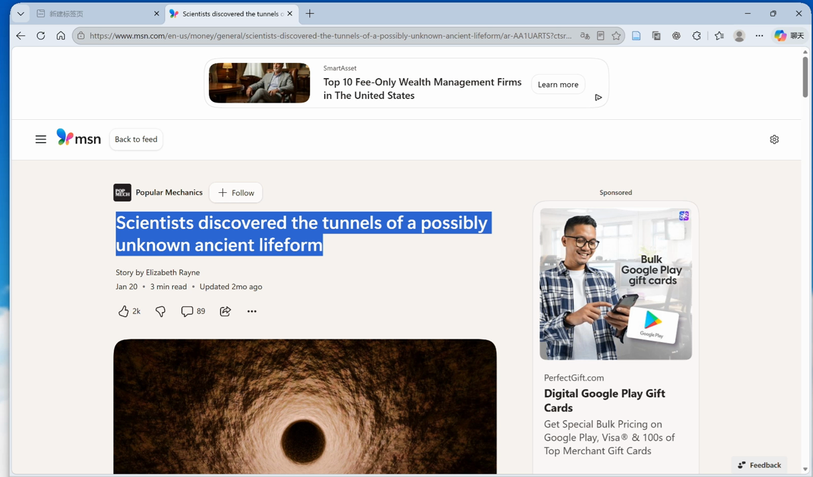
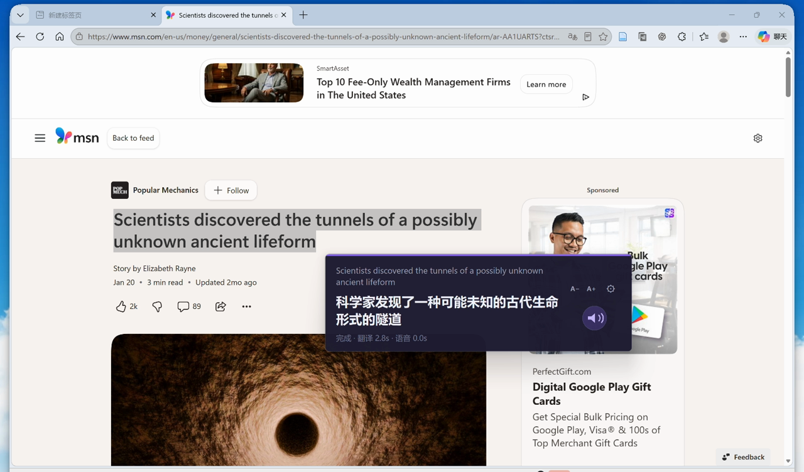

# SelectTranslate（划词翻译朗读）

一个轻量的 Windows 划词工具：选中英文后按 `Alt + Q`，即可查看中文翻译、音标并朗读原文。程序还会在本地记录词频、星标和拼写测试成绩。

## 操作演示

1. 在网页中选中英文，按 `Alt + Q`。

   

2. 浮窗显示翻译；点击扬声器按钮即可朗读原文。

   [](https://github.com/liyitong-alt/SelectTranslate/releases/download/v0.1.1/SelectTranslate-demo.mp4)

[观看完整演示视频（50 秒，MP4）](https://github.com/liyitong-alt/SelectTranslate/releases/download/v0.1.1/SelectTranslate-demo.mp4)

## 功能

- 全局快捷键划词翻译，支持浏览器、PDF 阅读器和常见桌面应用
- 英文自然语音朗读和语音缓存
- 单词音标、星标、查询历史和句内词频统计
- 自动隐藏常见虚词的高频词图表，与“看中文、听读音、拼英文”测试
- 翻译浮窗可用 `A−` / `A+` 调整字号，并自动记住大小
- 烟熏深色主题，并可在设置中自选界面强调色
- 可在设置中选择本地数据目录
- 内置免 Key 翻译，并可配置 DeepSeek、Qwen、GLM API
- API Key 使用 Windows DPAPI 加密，只能由保存密钥的 Windows 用户解密

## 安装与使用

从 GitHub Releases 下载 `SelectTranslate-Setup-*.exe`，安装时可以选择程序目录，并可选择桌面快捷方式和开机启动。

- `Alt + Q`：翻译当前选中文字
- `Alt + Shift + S`：打开单词本和设置
- `Alt + Shift + Q`：退出程序

默认数据目录为 `%LOCALAPPDATA%\SelectTranslate\data`。可在“设置 → 本地数据目录”中修改；切换时会迁移已有数据库和缓存，不会删除旧目录。

## 翻译服务

“自动”模式无需 API Key，会优先使用腾讯翻译并在失败时尝试 Microsoft。正式 API 模式需要用户自己的密钥：

| 服务 | 默认模型 | 官方接口 |
| --- | --- | --- |
| DeepSeek | `deepseek-flash` | `https://api.deepseek.com/chat/completions` |
| Qwen（阿里云百炼） | `qwen-plus` | `https://dashscope.aliyuncs.com/compatible-mode/v1/chat/completions` |
| GLM（智谱） | `glm-5.3-flash` | `https://open.bigmodel.cn/api/paas/v4/chat/completions` |

模型名可在设置中修改，以便服务商更新模型后继续使用。模型 API 可能收费，费用由密钥所属账号承担。

## 本地构建

需要 Windows 10/11 x64、Python 3.11+ 和 Inno Setup 6：

```powershell
powershell -ExecutionPolicy Bypass -File .\scripts\build.ps1
```

构建结果：

- 免安装目录：`dist\SelectTranslate`
- 安装程序：`release\SelectTranslate-Setup-0.1.1.exe`

## 隐私

只有用户主动按下快捷键后，选中的文字才会发送给当前选择的在线翻译与语音服务。本地单词本数据库不会随翻译请求上传。API Key 以 Windows DPAPI 密文保存在用户选择的数据目录。

## 许可证

项目代码采用 [MIT License](LICENSE)。第三方组件及来源说明见 [THIRD_PARTY_NOTICES.txt](THIRD_PARTY_NOTICES.txt)。
